# Evidence media checklist (screenshots & recordings)

Use this list on **dev** / **uat** / **prod** (adjust URLs). Prefer **silent** screen captures for long flows; **narrate live** during the defense.

**Cross-links:** [REQUIREMENTS_CHECKLIST.md](../REQUIREMENTS_CHECKLIST.md) · [REQUIREMENTS.md](../REQUIREMENTS.md) · [final-defense-script.md](final-defense-script.md)

**Files live in:** [evidence-media/](evidence-media/) · Original macOS timestamps: [evidence-media/MEDIA_MAPPING.txt](evidence-media/MEDIA_MAPPING.txt)

**This bundle (applied 2026-05-09):** Mostly **`app-dev`**, **`grafana-dev`**, **`claiset-dev`** kubectl; one **`EXTRA-`** **`app-prod`** still; **A2** RDS; **A3** state list (two-part scroll); **C1/C2/C4** Actions; **C6** UAT rollout + HTTP poll + **`C6-http-during-rollout-uat.txt`** log.

---

## Architecture & Terraform (≈20% + part of 15%)

### A1: App homepage + one inner functional page

**Rubric:** Screenshot(s) — **homepage** and **another** page (items / outfits / calendar). **HTTPS** + URL bar visible.

**Submission notes:** Primary captures use **`https://app-dev.claiset.xyz`** — **All items** (closet) and **Outfit calendar** (`/calendar`). For grading text that cites **prod**, narrate parity or add prod grabs later.

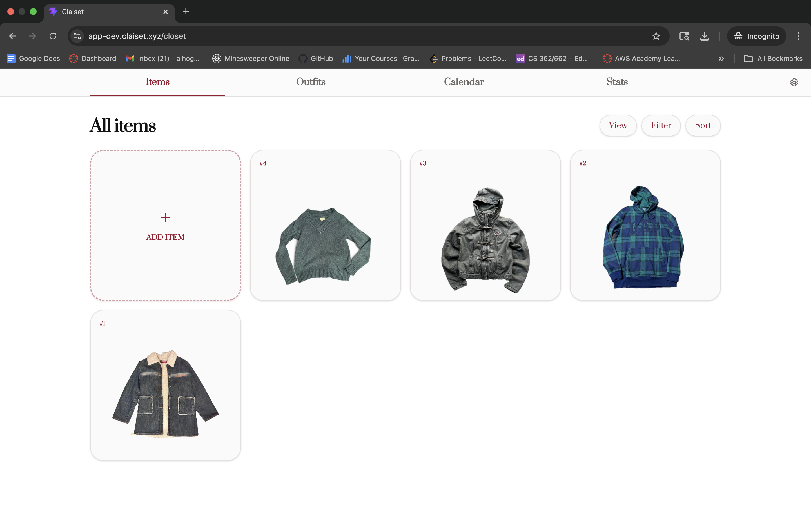

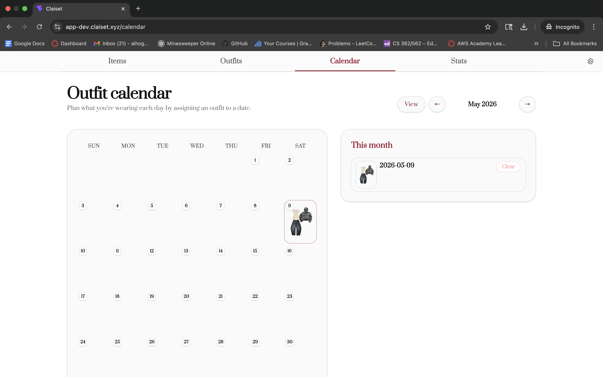

#### Extra angles (same A1 storyline)

Prod supplement, login, HTTPS site info, more dev pages — additional proof only.

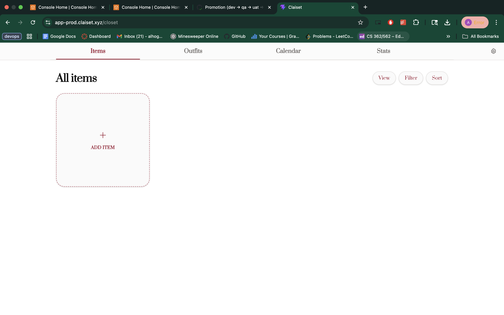

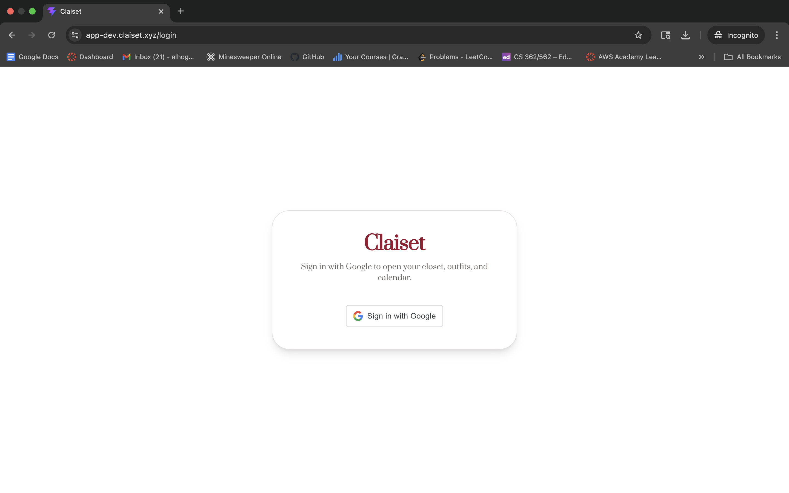

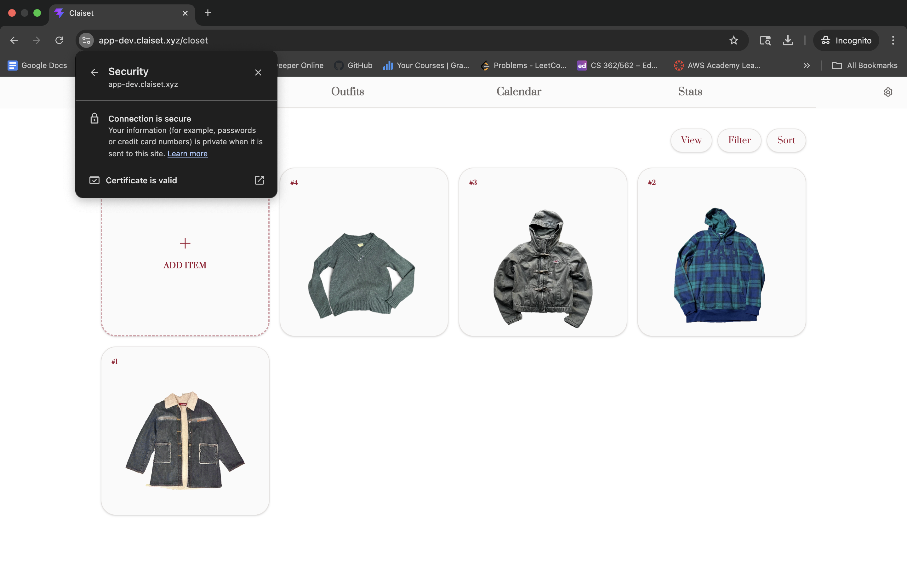

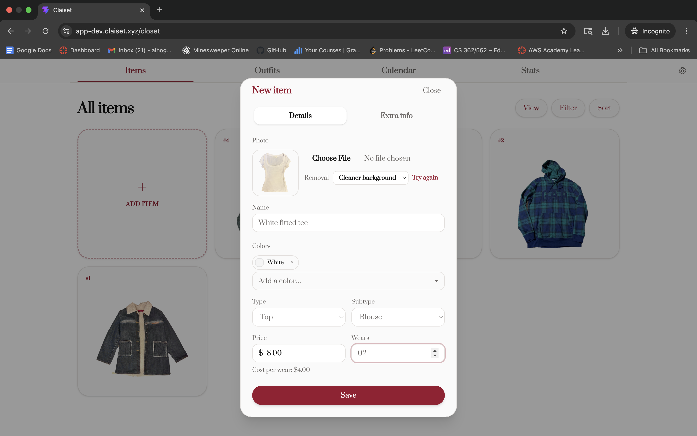

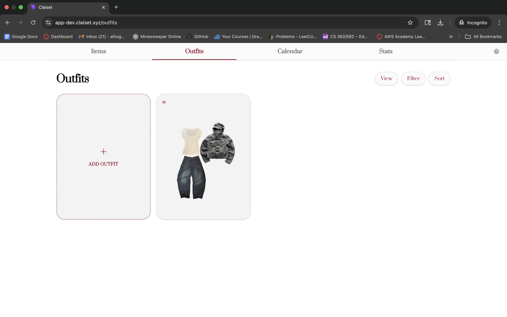

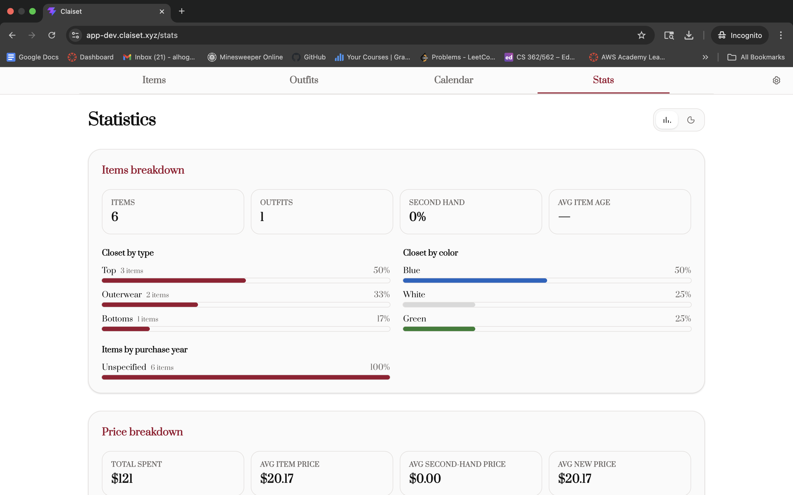

### A2: AWS RDS instance (console)

**Rubric:** Screenshot — RDS **identifier**, engine, status **Available**, same region as EKS.

**Submission notes:** Console list/detail capture — identifier + engine + **`Available`** visible.

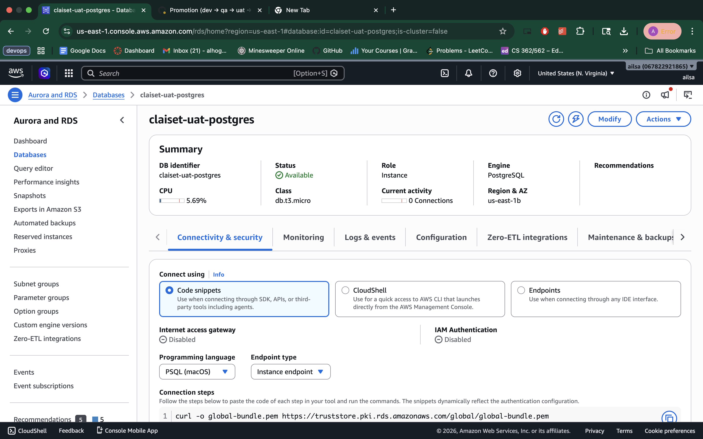

### A3: Terraform state excerpt

**Rubric:** Screenshot or paste — **`terraform state list`** lines showing **RDS** + **EKS** (`module.rds.*`, `module.eks.*`, etc.).

**Submission notes:** `terraform state list | grep -E 'module\.(rds|eks)\.'` (or full list). Two screenshots: first frame + continuation (long list / scroll).

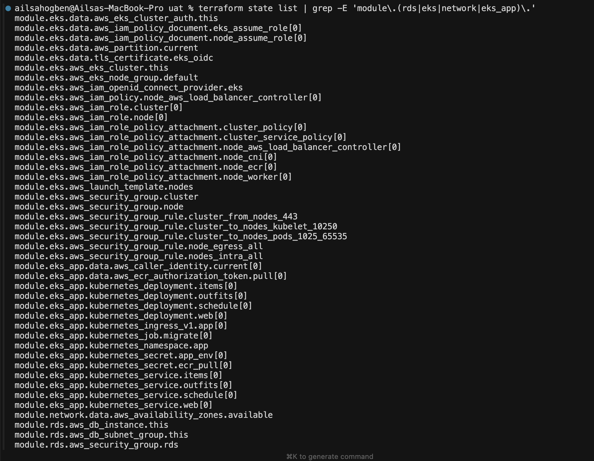

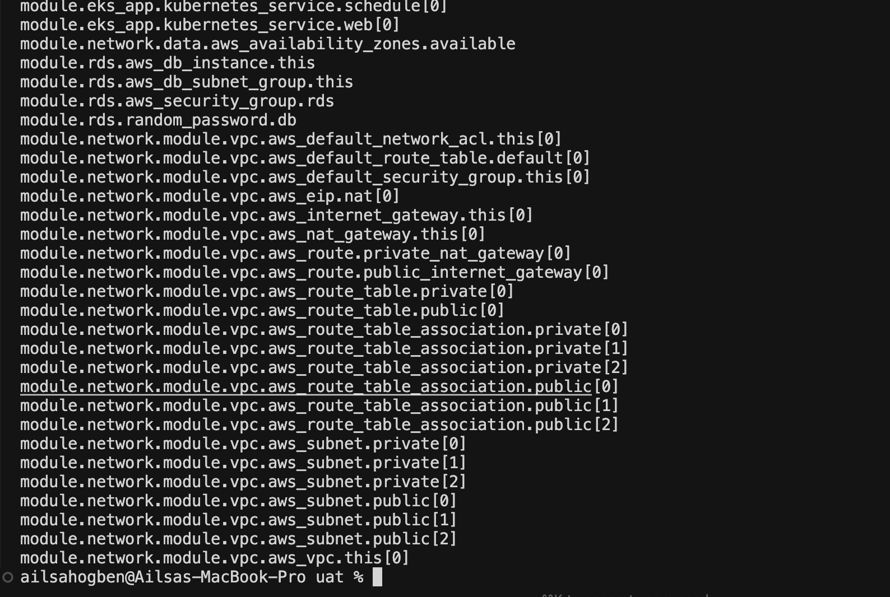

### A4: Microservice Deployments (`kubectl get deploy`)

**Rubric:** Screenshot — `kubectl -n <env> get deploy` with **`items`**, **`outfits`**, **`schedule`** (and **`web`** if useful).

**Submission notes:** Example from **`claiset-dev`** / namespace **`dev`**.

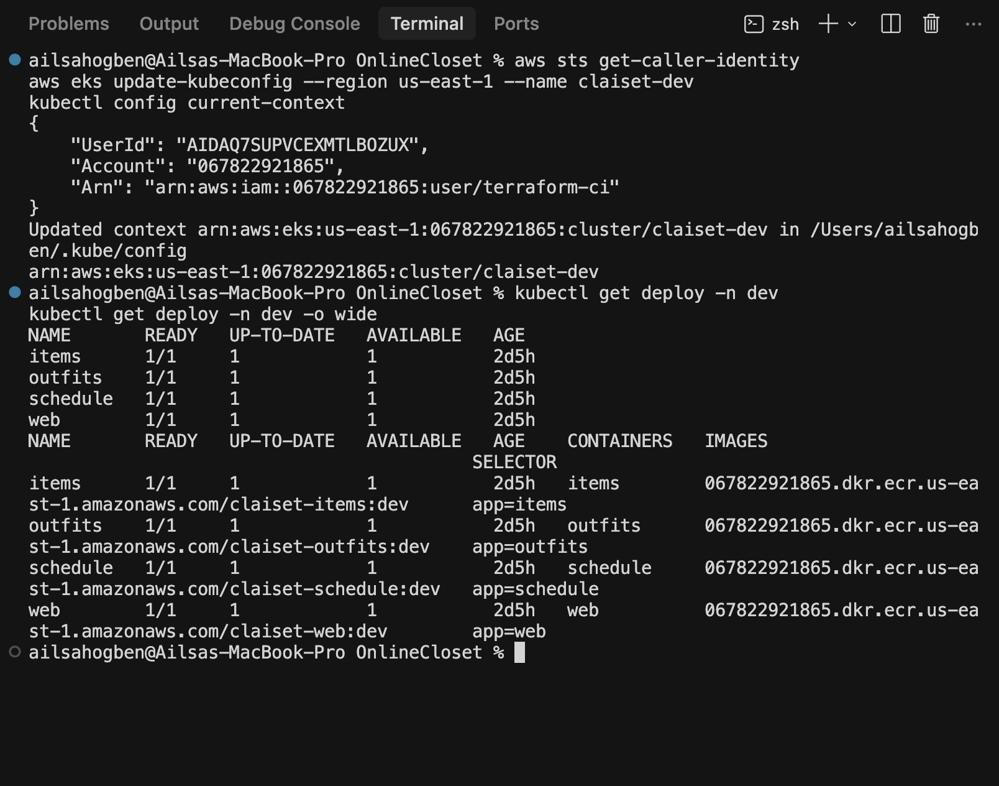

### A5: Ingress — DNS hostname + HTTPS / ACM

**Rubric:** Screenshot — `kubectl get ingress` (and/or **`describe`**) showing **hosts**, **ALB**, **ACM** annotation; ALB HTTPS in console works too.

**Submission notes:** **`app-dev.claiset.xyz`** + redirect / cert wiring on **`claiset`** Ingress.

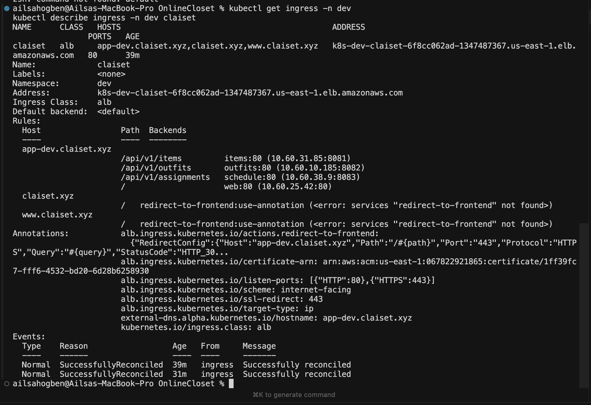

### A6: Terraform repo structure (`infra/modules`)

**Rubric:** Screenshot — IDE/GitHub **`infra/modules/`** tree (or sample files proving **VPC / EKS / RDS / IAM** under Terraform).

**Submission notes:** *Not bundled.* Add **`evidence-media/A6-infra-modules.png`** or link to repo path in slides.

---

## CI/CD & Git-driven promotion (≈15%)

### C1: GitHub Actions — promotion workflow graph (green path)

**Rubric:** Screenshot — **promotion.yml** workflow **graph**, at least one **successful** run (dev / UAT / prod path).

**Submission notes:** Promotion workflow graph / run list. If this grab fits **C2** better (merge context), swap filenames in **`MEDIA_MAPPING.txt`** only.

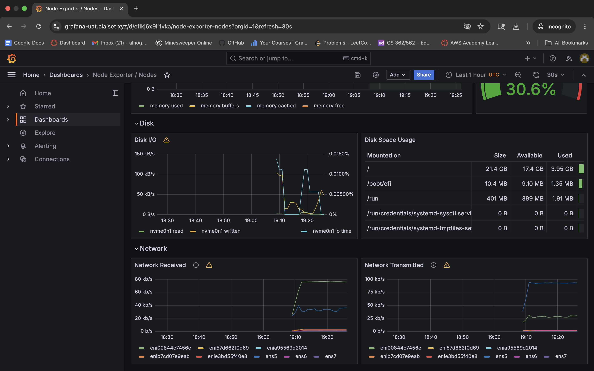

### C2: UAT triggered by merged PR

**Rubric:** Screenshot or link — run from **`pull_request` merged → UAT**, merge commit / PR visible.

**Submission notes:** Same-repo merge → **UAT** job visible in Actions (adjust filename ↔ **C1** in **`MEDIA_MAPPING.txt`** if your capture order differs).

### C3: Prod / gated prod — refs + Inputs

**Rubric:** Screenshot — **`workflow_dispatch`** or tag run; Summary shows **inputs** (**`target: prod`**) — no AWS Console deploy.

**Submission notes:** *Not bundled.* Add **`C3-…`** or link.

### C4: Terraform apply log (green)

**Rubric:** Screenshot/snippet — **apply** succeeding in Actions or terminal.

**Submission notes:** Green run / job summary (may overlap **C2** — keep clearest shot for each rubric row).

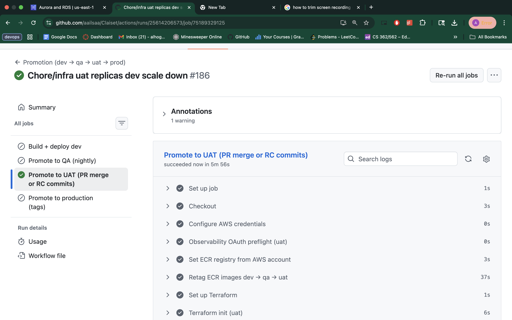

### C5: Canary / rolling strategy (README slide)

**Rubric:** One slide OR README pointer — chosen strategy **and why**.

**Submission notes:** Cite **[partial-canary-justification.md](partial-canary-justification.md)** (essay) + **[README.md](../README.md#progressive-rollout-strategy-eks)** (overview) and **`infra/modules/eks-app`** — no mandated screenshot.

### C6: Zero-downtime / rollout recording

**Rubric:** **Silent** clip or logs — rollout / **no sustained 5xx** + rollout success (**`kubectl rollout status`** or workflow step).

**How to reproduce / refresh:** **[zero-downtime-promotion-evidence.md](../zero-downtime-promotion-evidence.md)** · poll script **`infra/scripts/http-availability-during-rollout.sh`**.

**Submission notes:** **Verify file content** matches this rubric filename; remap using **MEDIA_MAPPING** if mislabeled.

📹 **[C6-rollout-or-deployment-recording.mov](evidence-media/C6-rollout-or-deployment-recording.mov)** (earlier dev session)

**UAT — silent screen + trimmed HTTP poll (all `200`):**

📹 **[C6-uat-rollout-screen-recording.mov](evidence-media/C6-uat-rollout-screen-recording.mov)**

📹 **[C6-uat-http-poll-all-200-trimmed.mov](evidence-media/C6-uat-http-poll-all-200-trimmed.mov)**

**UAT poll log (one line per second):** [`C6-http-during-rollout-uat.txt`](evidence-media/C6-http-during-rollout-uat.txt)

**Extra supporting clip:** 📹 **[S1-terraform-apply-or-infra-recording.mov](evidence-media/S1-terraform-apply-or-infra-recording.mov)** (_also_ supports **Presentation S1**.)

---

## Day 2: Schema migration (≈10%)

### D1: Migrate Job — `kubectl get jobs`

**Rubric:** Screenshot — **`migrate`** job **Complete**.

**Submission notes:** Namespace **`dev`** in current bundle.

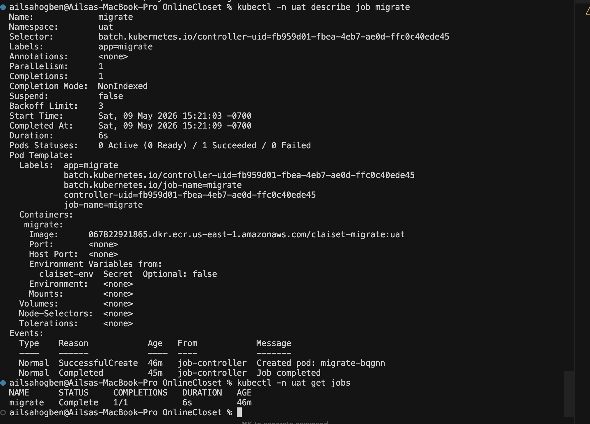

### D2: Migrate Job — `kubectl describe job migrate`

**Rubric:** Screenshot/paste — completion, backoff, image, events as applicable.

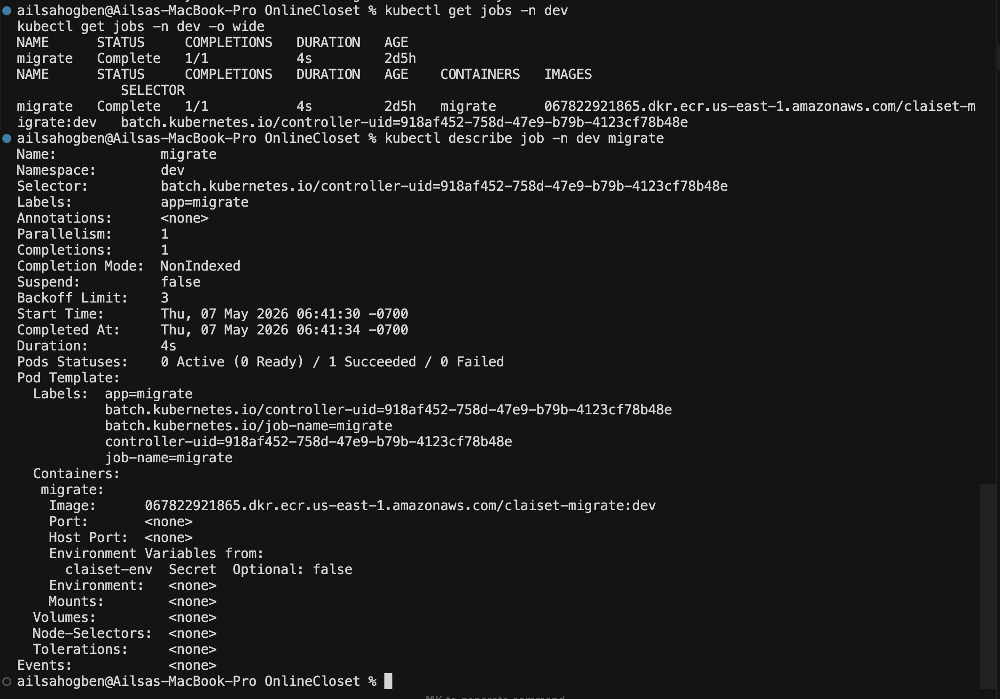

### D3 (optional): Explain migrate-before-app narrative

**Rubric:** Short clip or slide voice-over — migrate image/schema order vs app Deployments.

**Submission notes:** Optional; defend from **`migrate`** Dockerfile / entrypoint — no file required unless you record one.

---

## Day 2: OS / security patching (≈10%)

**Full runbook (console + CLI + what to narrate):** **[day2-os-node-patching.md](../day2-os-node-patching.md)** · **`bash infra/scripts/eks-node-patch-evidence.sh CLUSTER NODEGROUP`** for text snapshots.

### P1: Node AMI / LT — before

**Rubric:** Before shot — managed nodegroup **AMI** / launch template indicator.

**Submission notes:** *Not bundled yet.* Recommend: AWS Console node group overview **or** script output (**`describe-nodegroup`** `releaseVersion` / AMI line) saved as **`P1-nodegroup-before.png`** / **`.txt`**.

### P2: Node AMI / LT — after

**Rubric:** After shot — value **changed** post rotation.

**Submission notes:** *Not bundled.* Same capture after **`update-nodegroup-version`** / Console update → **`P2-nodegroup-after.…`**.

### P3: Smoke / tests pass during or after rotation

**Rubric:** Recording or logs — green workflow or **`kubectl`** + Ready app.

**Submission notes:** *Not bundled.* Run **`FRONTEND_HOST=… http-availability…sh`** during node recycle + **`bash infra/scripts/smoke-test-env.sh …`** afterward; paste log or **`P3-…`** filename.

### P4 (slide): Spoken patching logic

**Rubric:** One slide narrative — cordon/drain, **maxUnavailable** / surge, why users stay on healthy Pods.

**Submission notes:** Talk track bullets are in **`day2-os-node-patching.md` § 5**. Live defense / optional slide — Terraform **`max_unavailable_percentage`** sits in **`infra/modules/eks/main.tf`** (**`aws_eks_node_group.default`** **`update_config`**).

---

## Observability & logging (≈15%)

_Target **silent** Grafana tour **~3–8 min** if one file._

### O1: Monitoring pods — Prometheus, Grafana, Loki (+ Alertmanager, Promtail)

**Rubric:** Screenshot — `kubectl -n monitoring get pods` — core stack **Running/Ready**.

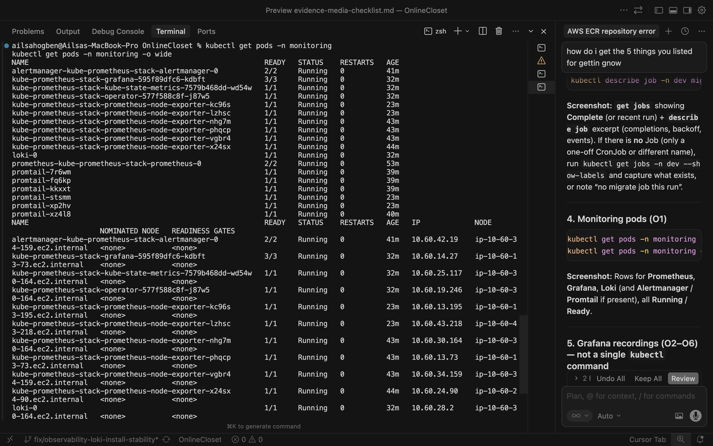

**Extra:**

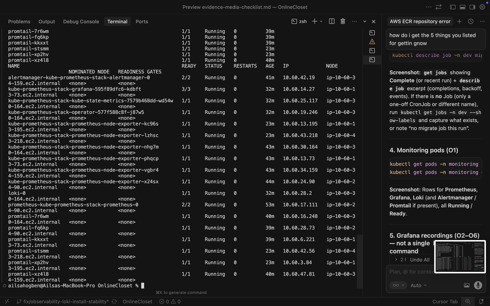

### O2: Grafana — reachable URL (+ URL bar)

**Rubric:** Recording — **`https://grafana-<env>.<domain>`** with URL bar visible.

**Submission notes:** Use combined tour; narration says **prod vs dev** if host differs.

📹 **[O2-O6-grafana-and-observability.mov](evidence-media/O2-O6-grafana-and-observability.mov)**

### O3: Grafana — Google OAuth path

**Rubric:** Recording — Sign in → **Google** redirect → land in Grafana (not password-first).

📹 **[O2-O6-grafana-and-observability.mov](evidence-media/O2-O6-grafana-and-observability.mov)**

**Screenshot assist:** OAuth entry context on **`app-dev` login**:

### O4: Explore → Prometheus sample query

**Rubric:** Recording — Prometheus query returning data (**`up`**, CPU, etc.).

📹 **[O2-O6-grafana-and-observability.mov](evidence-media/O2-O6-grafana-and-observability.mov)**

### O5: Node metrics — CPU, memory, disk

**Rubric:** Recording **or** strong stills — **CPU**, **memory**, **disk** (dashboard or Explore).

**Still images:** Node exporter dashboard (**CPU/mem**) + Explore **filesystem** avail + preset dashboard (**disk I/O**; preset “disk space” may be empty narrate Explore fix).

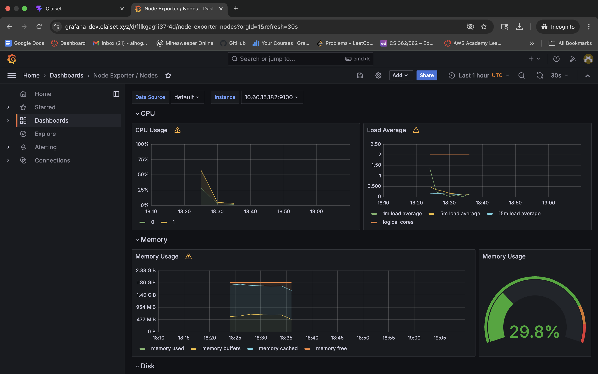

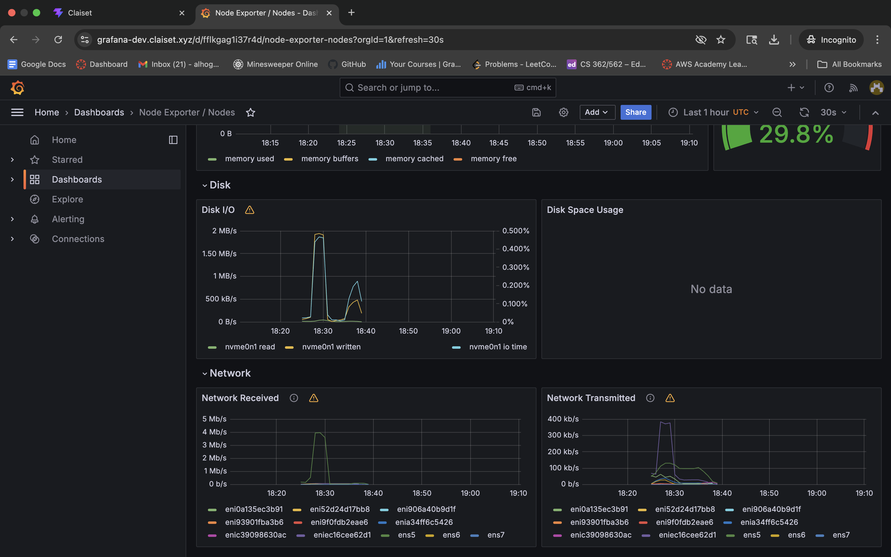

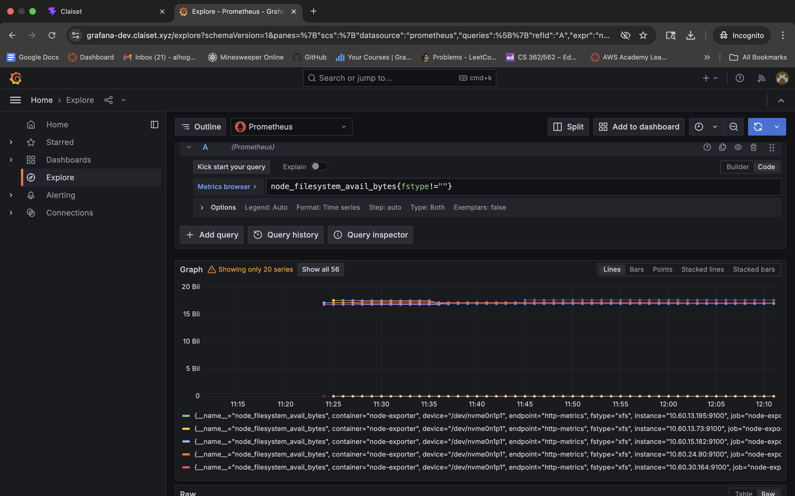

📹 Same topic in motion:

📹 **[O2-O6-grafana-and-observability.mov](evidence-media/O2-O6-grafana-and-observability.mov)**

### O6: Loki queries — items, outfits, schedule (+ combined)

**Rubric:** Recording — **`{namespace="<env>",container="items"}`** (then outfits, schedule) plus broader **`{namespace="<env>"}`** or equivalent.

📹 **[O2-O6-grafana-and-observability.mov](evidence-media/O2-O6-grafana-and-observability.mov)**

### O7: Alerts — drill + received notification

**Rubric:** Screenshot — **received** Email/Slack + optional terminal from **`infra/scripts/alert-drill.sh`**.

**Submission notes:** *Not bundled.*

---

## Presentation format (≈15% rubric bucket)

### S1: Silent video — provisioning / deploy / destroy slice

**Rubric:** **Silent** footage only for long infra operations.

📹 **[S1-terraform-apply-or-infra-recording.mov](evidence-media/S1-terraform-apply-or-infra-recording.mov)**

_(Also listed under **C6** as supporting infra automation.)_

### S2: Deck + links

**Rubric:** Slides with **thumbnail + link** to clips; bullets from **`docs/final-defense-script.md`**.

**Submission notes:** Slide deck artifact outside repo or course upload.

### S3: Chaos-defense practice (~2 minutes)

**Rubric:** Rehearsed timer run — instructor chaos scenario rehearsal.

**Submission notes:** No file — practice offline.

---

## Live demo only (during grading — minimal capture)

### L1: Live narration over silent / prerecorded material

**Rubric:** **Your voice** over prepared media — avoid “new silent clicking” replacing narration.

### L2: Chaos defense (~1–2 min instructor-driven)

**Rubric:** **Metrics + logs** to diagnose hypothetical failure — bookmark Explore queries beforehand.

### L3: Q&A

**Rubric:** Short live answers; optional one Grafana tab if network allows *(not required)*.

**Optional fallback:** Single live **`kubectl get pods`** or one Explore query — keep **offline screenshot** backup if Wi‑Fi flakes.

---

## Pre-capture (once)

- [ ] Add **`A2`**, **`A3`**, **`A6`**, **`C1–C4`**, **`O7`** if missing for final submission (or cite **URLs** in slides instead).
- [ ] **`evidence-media/NOTES.txt`** — env + date per capture.
- [ ] Paste **green Actions** URLs (dev merge, UAT, prod) in NOTES or slides.

---

## Quick “done” gate

- [ ] Every unchecked item in **[REQUIREMENTS_CHECKLIST.md](../REQUIREMENTS_CHECKLIST.md)** has either a **file** here, a **URL**, or an **explicit slide**.
- [ ] Self-grading comments filled (bottom of **`REQUIREMENTS_CHECKLIST.md`**).
- [ ] Chaos story rehearsed **twice** on a timer.

---

## Rubric weight reference (compact)

Infrastructure (Terraform): **20%** — aligns with § Architecture + parts of deployments. Application & networking: **15%** — § Architecture + rollout. CI/CD GitOps: **15%** — § CI/CD. Day 2 patching: **10%** § P*. Day 2 schema: **10%** § D*. Observability & logging: **15%** — § Observability. Presentation / defense: **15%** — § Presentation + live **L***.
